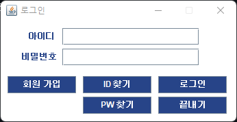
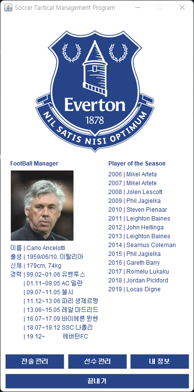
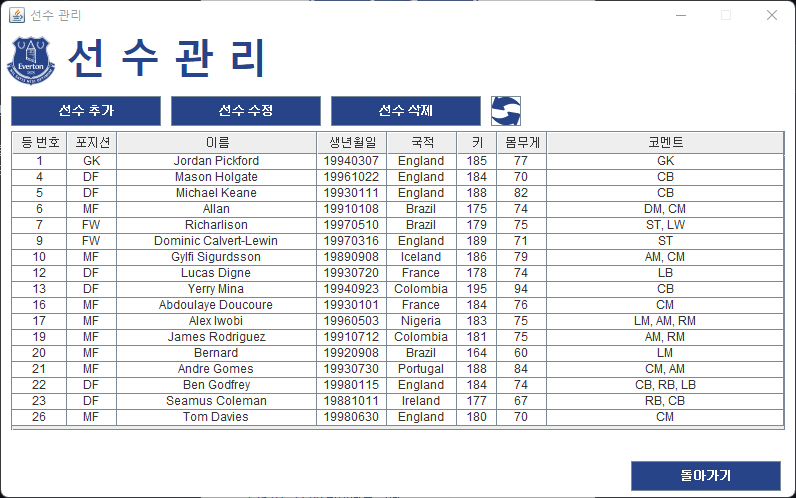
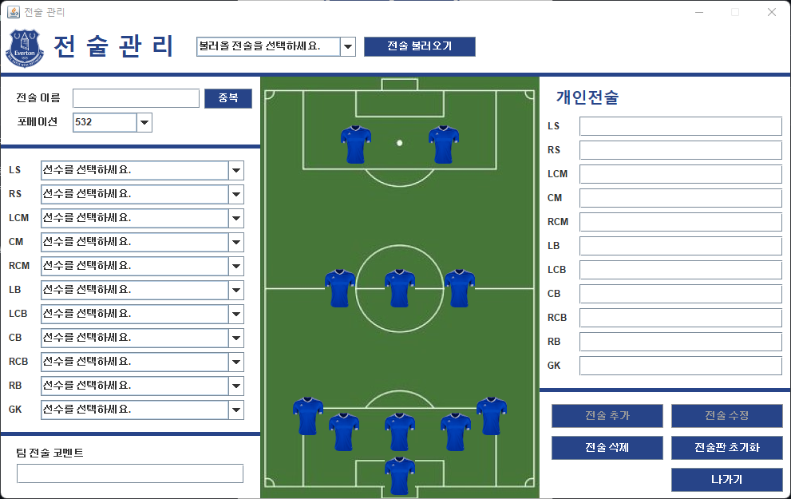
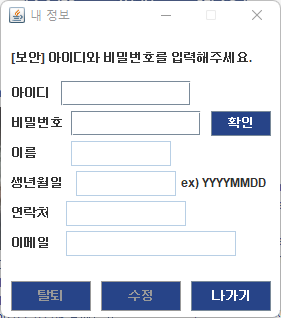

# project-stmp | 축구 전술 관리 프로그램
> 나만의 축구 전술을 생성하고 관리하는 자바 프로그램


<div align="center">
    <image src="readme/images/main.png" style="float: left; width: 150px; height: 350px;"/>
      <image src="readme/images/tm.png" style="width: 500px; height: 350px;"/>
</div>
<br />

축구 전술 관리 프로그램은 팀 관리 및 전술 구축을 위한 도구입니다. 
이 솔루션은 선수들의 정보를 체계적으로 등록하고 관리할 뿐만 아니라, 팀의 전략과 전술까지도 철저히 다룹니다. 
직관적인 GUI를 통해 정보를 한눈에 볼 수 있으며, 각 선수의 역할과 개인 임무를 기반으로 한 세부적인 전술을 구성할 수 있습니다. 
이를 통해 팀의 전략을 세밀하게 설정하여 경기력을 높일 수 있습니다. 
팀의 강점을 최대한 살려 팀원들의 역할을 최적화하고, 훌륭한 전술을 구사하여 승리로 이끌어나갈 수 있는 프로그램입니다.  

더욱이, 선수 정보와 전술 정보를 함께 관리하면서 유연성을 높이고, 개선점을 신속하게 파악하여 팀의 전략을 지속적으로 발전시킬 수 있습니다. 
이는 경기의 결과뿐만 아니라 선수들의 개인적인 성장에도 도움을 줄 수 있는 강력한 도구입니다.  

## 시작하기

### 설치

윈도우:
1. Git Repository 를 Clone 합니다.
```sh
git clone https://github.com/jeongwon201/project-stmp.git
```

2. 현재 Directory 를 변경합니다.
```sh
cd stmp
```

3. 빌드 명령을 실행하세요.
```sh
mvn package
```

4. JAR 파일을 실행합니다.
```sh
java -jar stmp-{version}-jar-with-dependencies.jar
```

### 사용 예제

#### 로그인
<div>
  
</div>
<br />

모든 사용자는 회원 가입을 통해 사용자 본인의 정보를 등록 후 이용이 가능하며,  
ID 또는 PW 를 분실했을 경우 ID 찾기 · PW 찾기 기능을 통해 분실된 ID와 PW 를 찾을 수 있습니다.  
<br />

#### 메인
<div>
  
</div>
<br />

메인은 에버튼 클럽의 간단한 정보와 전술 관리, 선수 관리, 내 정보로 구성되어 있습니다.  
<br />

#### 선수 관리
<div>
  
</div>
<br />

선수 관리에서 내가 원하는 선수의 정보를 입력하고 저장하여 관리할 수 있습니다.  
추가된 선수는 수정과 삭제가 가능합니다.  
<br />

#### 전술 관리
<div>
  
</div>
<br />

화면에서 보이는 532 포메이션 외 여러 포메이션을 지원하며,  
전술에 대한 간단한 코멘트를 작성할 수 있습니다.  

선수 관리에서 추가된 모든 선수는 전술의 각 포지션에 할당하고,  
개인 전술을 부여할 수 있습니다.  

추가된 전술은 상단의 전술 불러오기를 통해 언제든지 불러와 수정 또는 삭제가 가능합니다.  

전술 초기화를 통해 모든 항목을 처음 상태로 되돌릴 수 있습니다.  
<br />

#### 내 정보
<div>
  
</div>
<br />

보안을 위해 ID 와 PW 를 입력하여 인증 후 수정 또는 탈퇴가 가능합니다.  

ID 는 수정할 수 없으며, ID 를 제외한 모든 항목은 수정이 가능합니다.  
<br />
<br />
_더 많은 예제와 사용법은 다음 링크를 참고하세요._

- <a href="https://github.com/jeongwon201/project-stmp/blob/main/readme/login.md" target="_blank"> 로그인</a>
- <a href="https://github.com/jeongwon201/project-stmp/blob/main/readme/pm.md" target="_blank"> 선수 관리</a>
- <a href="https://github.com/jeongwon201/project-stmp/blob/main/readme/tm.md" target="_blank"> 전술 관리</a>
- <a href="https://github.com/jeongwon201/project-stmp/blob/main/readme/myinfo.md" target="_blank"> 내 정보</a>

## 업데이트 내역

* 1.1.0
  * MariaDB to SQLite
  * 내부 파일 구조 변경
  * ImageLoader 추가
* 1.0.0
    * 첫 출시
* 0.0.1
    * 작업 진행 중

## 작성자
- 이정원 - jeongwon201@naver.com

## 라이센스

이 프로젝트는 MIT 라이센스를 준수하며 <a href="https://github.com/jeongwon201/project-stmp/blob/main/LICENSE">LICENSE</a>에서 자세한 정보를 확인할 수 있습니다.

## 기여 방법

1. (<https://github.com/jeongwon201/project-stmp/fork>)을 포크합니다.
2. (`git checkout -b feature/fooBar`) 명령어로 새 브랜치를 만드세요.
3. (`git commit -am 'Add some fooBar'`) 명령어로 커밋하세요.
4. (`git push origin feature/fooBar`) 명령어로 브랜치에 푸시하세요. 
5. 풀리퀘스트를 보내주세요.

<!-- Markdown link & img dfn's -->
[npm-image]: https://img.shields.io/npm/v/datadog-metrics.svg?style=flat-square
[npm-url]: https://npmjs.org/package/datadog-metrics
[npm-downloads]: https://img.shields.io/npm/dm/datadog-metrics.svg?style=flat-square
[travis-image]: https://img.shields.io/travis/dbader/node-datadog-metrics/master.svg?style=flat-square
[travis-url]: https://travis-ci.org/dbader/node-datadog-metrics
[wiki]: https://github.com/yourname/yourproject/wiki
