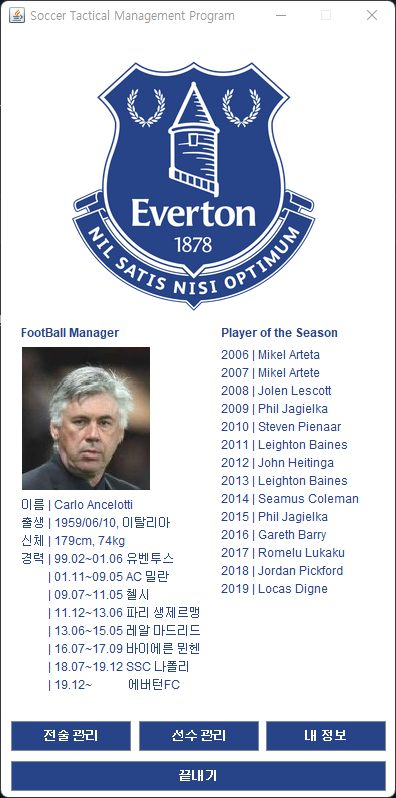

# project-stmp | 축구 전술 관리 프로그램

사용자가 응원하는 축구 클럽의 선수 또는 현재 우수한 성적을 거두고 있는 선수를 등록하여 관리하고,  
등록된 선수들을 조합하여 포메이션의 각 포지션에 할당해 나만의 전술을 저장하고 관리할 수 있는 프로그램입니다.  

### 프로젝트 설명

실행 시 최초 화면입니다.  

  

 

모든 사용자는 회원 가입을 통해 사용자 본인의 정보를 등록 후 이용이 가능하며,  
ID 또는 PW 를 분실했을 경우 ID 찾기 · PW 찾기 기능을 통해 분실된 ID와 PW 를 찾을 수 있습니다.  
 

로그인 성공 시 메인으로 이동됩니다.  

  

 

메인은 에버튼 클럽의 간단한 정보와 전술 관리, 선수 관리, 내 정보로 구성되어 있습니다.  
 

### 선수 관리
선수 관리 화면입니다.  

  

 

선수 관리에서 내가 원하는 선수의 정보를 입력하고 저장하여 관리할 수 있습니다.  
선수 추가 시 등 번호는 중복될 수 없으며, 추가된 선수는 수정과 삭제가 가능합니다.  
 

### 전술 관리
전술 관리 화면입니다.  

  

 

전술 이름은 중복될 수 없습니다.  

화면에서 보이는 532 포메이션 외 여러 포메이션을 지원하며, 콤보 박스를 클릭하여 변경이 가능합니다.  

팀 전술 코멘트를 통해 전술에 대한 코멘트를 작성할 수 있습니다.  

선수 관리에서 추가된 모든 선수는 전술의 각 포지션에 할당이 가능하며,  
각 선수 별 개인 전술을 입력할 수 있습니다.  

한 전술에 동일한 선수 두 명을 할당할 수 없으며,  
전술 추가 시 입력되지 않은 항목이 존재하면 전술을 추가할 수 없습니다.  
<br/ >

### 내 정보
내 정보 화면입니다.

  

 

보안을 위해 ID 와 PW 를 입력하여 확인 후 수정 또는 탈퇴가 가능합니다.  

ID 는 수정할 수 없으며, ID 를 제외한 모든 항목은 수정이 가능합니다.
