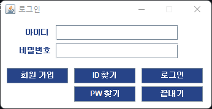
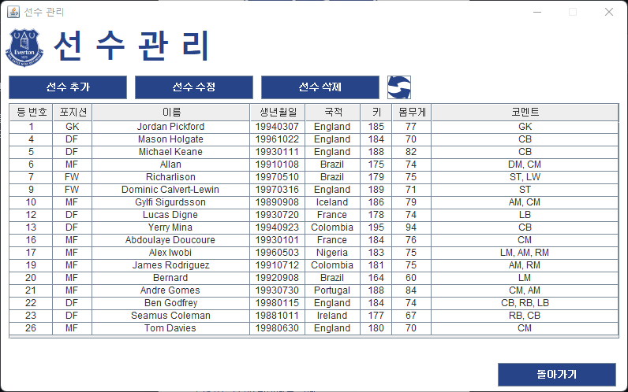
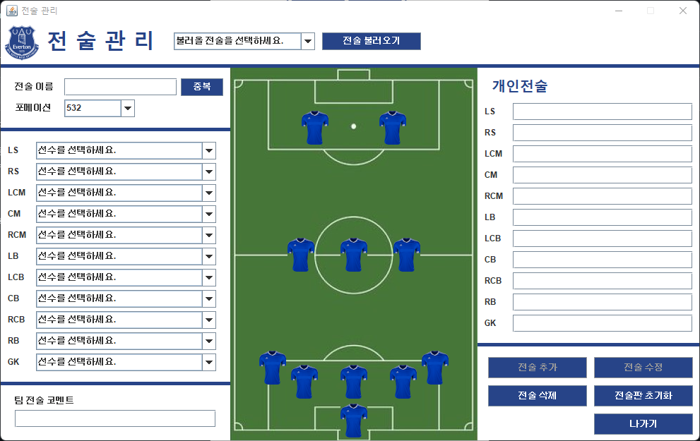
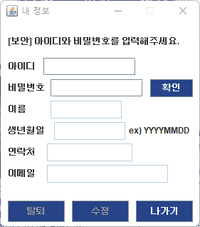

# project-stmp | 축구 전술 관리 프로그램

사용자가 응원하는 축구 클럽의 선수 또는 현재 우수한 성적을 거두고 있는 선수를 등록하여 관리하고,  
등록된 선수들을 조합하여 포메이션의 각 포지션에 할당해 나만의 전술을 저장하고 관리할 수 있는 프로그램입니다.  
 
 

## 프로젝트 배경 및 과정

축구를 좋아하는 사람이라면, 애정하는 클럽이 있기 마련입니다.  

응원하는 클럽이 성적이 저조하거나 아쉽다면,  
"이렇게 포메이션 또는 전술을 구성하면 어떨까 ?" 라는 생각을 종종하곤 합니다.  

또 축구 블로그를 운영 중이거나 커뮤니티 사이트에서 활발히 활동하는 사람이라면,  
위 처럼 생각뿐 아니라 실제 글로 포스팅할 수 있습니다.  

이러한 상황에서 내가 직접 선수와 전술을 구상하고 관리할 플랫폼이 있다면,  
일반 스포츠인에게는 재미, 블로거나 커뮤니티 활동에 있어서 편리할 것이라 생각합니다.  

저는 평소에 축구에 관심이 많아 해외 축구를 자주 보고, 또 즐겨하는 스포츠인입니다.  
축구에 관련된 프로젝트를 하고 싶은 마음이 있었지만 전공 지식이 미흡하여 실천하지 못하였습니다.  

그러나 학업 중 이 프로젝트 기회가 생겨 기획하게 되었습니다.  
 
 

## 프로젝트 기능
프로젝트에 사용된 기술 스택은 다음과 같습니다.  
> Language - JAVA 1.8  
> Database - MariaDB  
> IDE - Eclipse
 

다음은 이미지와 기능에 대한 설명입니다.  
 

### 최초 화면
실행 시 최초 화면입니다.  

  

 

모든 사용자는 회원 가입을 통해 사용자 본인의 정보를 등록 후 이용이 가능하며,  
ID 또는 PW 를 분실했을 경우 ID 찾기 · PW 찾기 기능을 통해 분실된 ID와 PW 를 찾을 수 있습니다.  

로그인 관련 각 항목에 대한 자세한 설명은 다음 링크에서 확인 가능합니다.  
<a href="https://github.com/jeongwon201/project-stmp/blob/main/readme/login.md"> 로그인 관련 설명 및 구동</a>  
 

### 메인
로그인 성공 시 메인으로 이동됩니다.  

  

 

메인은 에버튼 클럽의 간단한 정보와 전술 관리, 선수 관리, 내 정보로 구성되어 있습니다.  
 

### 선수 관리
선수 관리 화면입니다.  

  

 

선수 관리에서 내가 원하는 선수의 정보를 입력하고 저장하여 관리할 수 있습니다.  
추가된 선수는 수정과 삭제가 가능합니다.  
 

선수 관리의 각 항목에 대한 자세한 설명은 다음 링크에서 확인 가능합니다.  
<a href="https://github.com/jeongwon201/project-stmp/blob/main/readme/pm.md"> 선수 관리 설명 및 구동</a>  
 

### 전술 관리
전술 관리 화면입니다.  

  

 

화면에서 보이는 532 포메이션 외 여러 포메이션을 지원하며,  
전술에 대한 간단한 코멘트를 작성할 수 있습니다.  

선수 관리에서 추가된 모든 선수는 전술의 각 포지션에 할당하고,  
개인 전술을 부여할 수 있습니다.  

추가된 전술은 상단의 전술 불러오기를 통해 언제든지 불러와 수정 또는 삭제가 가능합니다.  

전술 초기화를 통해 모든 항목을 처음 상태로 되돌릴 수 있습니다.  

전술 관리의 각 항목에 대한 자세한 설명은 다음 링크에서 확인 가능합니다.  
<a href="https://github.com/jeongwon201/project-stmp/blob/main/readme/tm.md"> 전술 관리 설명 및 구동</a>  
 

### 내 정보
내 정보 화면입니다.

  

 

보안을 위해 ID 와 PW 를 입력하여 확인 후 수정 또는 탈퇴가 가능합니다.  

ID 는 수정할 수 없으며, ID 를 제외한 모든 항목은 수정이 가능합니다.

내 정보의 각 항목에 대한 자세한 설명은 다음 링크에서 확인 가능합니다.  
<a href="https://github.com/jeongwon201/project-stmp/blob/main/readme/myinfo.md"> 내 정보 설명 및 구동</a>  
