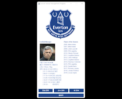

# project-stmp | 축구 전술 관리 프로그램 - 전술 관리

전술 관리와 관련된 항목에 대한 설명 및 구동입니다.  

### 전술 추가

  

 

전술 이름은 중복될 수 없습니다.  

화면에서 보이는 532 포메이션 외 여러 포메이션을 지원하며, 콤보 박스를 클릭하여 변경이 가능합니다.  

팀 전술 코멘트를 통해 전술에 대한 코멘트를 작성할 수 있습니다.  

선수 관리에서 추가된 모든 선수는 전술의 각 포지션에 할당이 가능하며,  
각 선수 별 개인 전술을 입력할 수 있습니다.  

한 전술에 동일한 선수 두 명을 할당할 수 없으며,  
전술 추가 시 입력되지 않은 항목이 존재하면 전술을 추가할 수 없습니다.  
 

### 전술 불러오기

  

 

상단의 콤보 박스에서 사용자가 추가한 전술 목록이 제공됩니다.  

불러올 전술을 선택 후 전술 불러오기 버튼을 클릭하면,  
모든 항목이 사용자가 선택한 전술의 데이터로 채워집니다.
 

### 전술 수정

  

 

전술 이름 외 모든 항목은 수정이 가능합니다.  

전술 추가와 마친가지로 한 전술에 동일한 선수 두 명을 할당할 수 없으며,  
전술 추가 시 입력되지 않은 항목이 존재하면 전술을 추가할 수 없습니다.  
 

### 전술 삭제

  

 

전술 이름 외 모든 항목은 수정이 가능합니다.  

전술 추가와 마친가지로 한 전술에 동일한 선수 두 명을 할당할 수 없으며,  
전술 추가 시 입력되지 않은 항목이 존재하면 전술을 추가할 수 없습니다.  
 

### 전술 초기화

  

 

전술 관리의 모든 항목을 처음 상태로 되돌립니다.  
 
